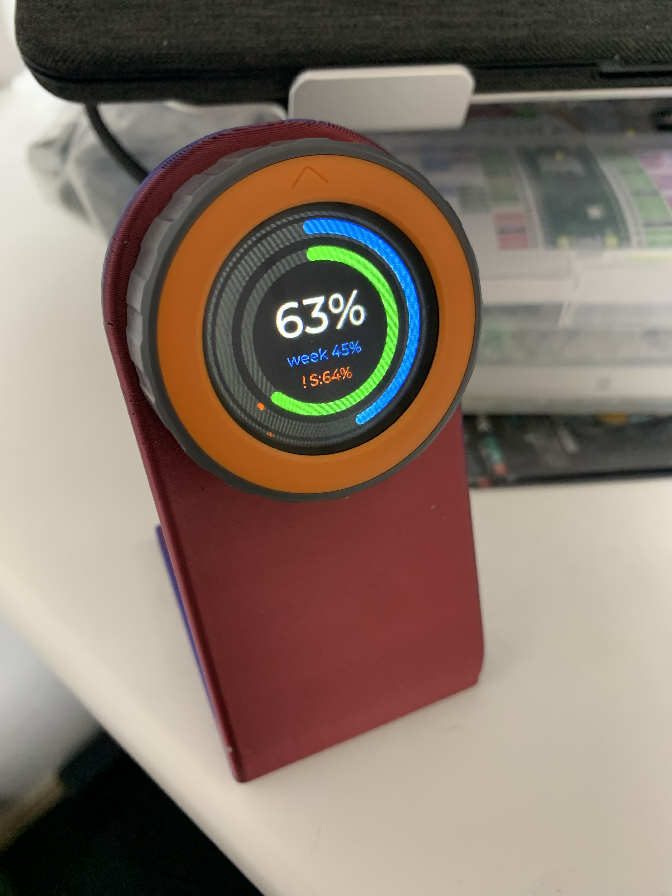

# Claude Code Usage Monitor (Waveshare ESP32-S3-Touch-LCD-2.1)

A physical desk monitor showing live **Claude Code 5-hour session** and **weekly**
usage on a 480×480 round touch LCD. Inspired by [Claudial](https://github.com/Moge800/Claudial).



## How it works

```
PC daemon (reads Anthropic rate-limit headers via a tiny API call)
        │  MQTT (+ Home Assistant auto-discovery)
        ▼
Home Assistant  ──ESPHome native API──►  ESP32-S3-Touch-LCD-2.1
                                          two-arc LVGL gauge UI
```

- **`daemon-mqtt/`** — Go daemon. Reads `~/.claude/.credentials.json`, calls the
  Anthropic API every 60s, parses `anthropic-ratelimit-unified-5h/7d-*` headers,
  publishes to MQTT with HA discovery. Runs as a systemd service in WSL.
- **`claude-monitor.yaml`** — ESPHome firmware for the board (ST7701 RGB panel via
  `mipi_rgb` + TCA9554 expander, CST820 touch, LVGL two-arc dashboard).
- **`reference/`** — Waveshare's official demo (authoritative pins + ST7701 init seq).
- **`PROJECT.md`** — build log, phases, and hardware quick-reference.

## Setup

1. `daemon-mqtt/`: copy `.env.example` → `.env`, set broker + creds, build & run
   (see `daemon-mqtt/README.md`).
2. `claude-monitor.yaml`: set `secrets.yaml` (WiFi), flash via ESPHome.

Secrets (`.env`, `secrets.yaml`) are gitignored.

## Hardware

Waveshare ESP32-S3-Touch-LCD-2.1: ESP32-S3R8, 480×480 round IPS, ST7701S (RGB),
CST820 touch, TCA9554 expander, 8MB PSRAM. See `PROJECT.md` for the full pinout.
